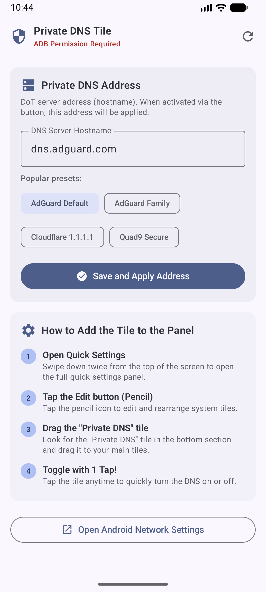

<h1 align="center">Private DNS Shortcut (Quick Settings Tile)</h1>

<p align="center">
  
  
  
</p>

<p align="center">
  A lightweight, battery-friendly Android utility to toggle your system's <strong>Private DNS (DNS over TLS)</strong> directly from the Quick Settings panel, just like Wi-Fi or Bluetooth.
</p>

---

## 📸 Screenshots

<p align="center">
  
  <!-- Placeholder for QS panel screenshot -> you can add it later -->
  <!--  -->
</p>

## ✨ Why this app?

Many users rely on custom DNS providers (like AdGuard, Cloudflare, or Quad9) to block ads, protect privacy, or bypass restrictions. However, navigating deep into Android Settings to toggle it on/off is tedious.

Traditional local VPN apps that provide DNS filtering can drain battery by running constantly in the background and prevent you from using a real VPN simultaneously. 

**This app solves these problems by:**
1. Directly manipulating the native Android System Settings.
2. Providing a Quick Settings Tile for a true 1-tap toggle.
3. Consuming 0% background battery (it runs for a millisecond to apply the setting and closes).
4. Allowing you to use a real VPN alongside your Private DNS.

## 🚀 Features

- **Instant Toggle:** One-tap switch from the notification shade.
- **Customizable Hostnames:** Pre-configured with popular presets (AdGuard, Cloudflare, Quad9), but fully supports any custom DoT hostname.
- **Bilingual Interface:** Supports English and Portuguese automatically based on system language.
- **Material Design 3:** Modern, clean UI built with Jetpack Compose.
- **No Root Required:** Uses ADB permissions to grant system write access securely.

## 🛠️ How to Setup (One-time ADB Permission)

Because Android protects secure system network settings, you must grant a specific permission to this app via a computer once after installation. No root is required!

1. Install the APK on your device.
2. Enable **USB Debugging** in your Android's Developer Options.
3. Connect your phone to your computer via USB.
4. Open a terminal/CMD on your computer and run the following command:

```bash
adb shell pm grant com.aistudio.privatedns.qxtile android.permission.WRITE_SECURE_SETTINGS
```

*(Alternatively, you can copy this exact command directly from the app's main screen).*

### Adding the Quick Settings Tile:
1. Swipe down twice from the top of your screen to fully expand the Quick Settings panel.
2. Tap the **Edit (Pencil)** icon.
3. Scroll down to find the **"Private DNS"** tile.
4. Drag and drop it into your active tiles section.
5. Tap to toggle instantly!

## 💻 Tech Stack
- **Language:** Kotlin
- **UI Toolkit:** Jetpack Compose (Material 3)
- **Architecture:** MVVM (Model-View-ViewModel)
- **Platform API:** `android.service.quicksettings.TileService`, `android.provider.Settings`

## 📝 License
This project is open-source and available under the [MIT License](LICENSE). Feel free to clone, edit, or improve!
